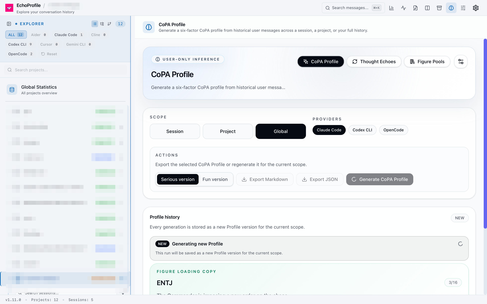
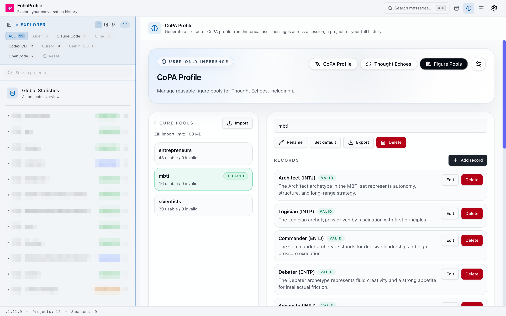
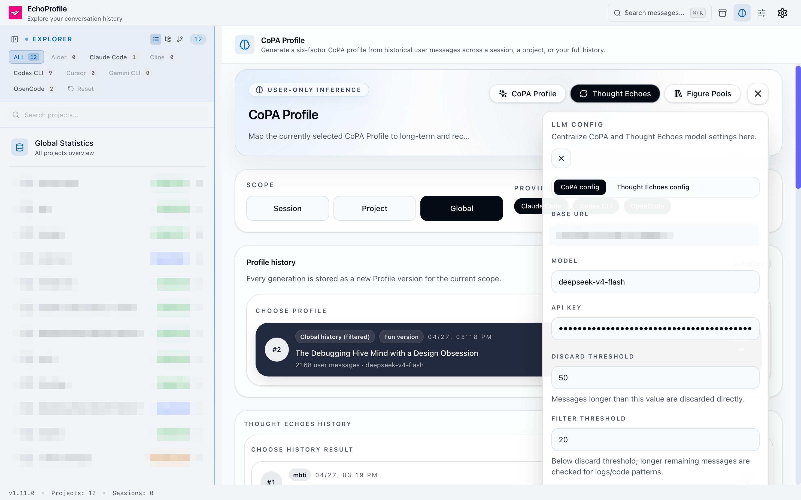

<div align="center">
  

  <h1>EchoProfile</h1>

  <p><strong>Turn your AI conversation history into a personal AI profile.</strong></p>

  <p>
    
    
    
    
    
    <a href="https://arxiv.org/abs/2604.14773"></a>
  </p>

  <p>
    <a href="#what-can-it-do-today">Features</a> ·
    <a href="#quick-start">Quick Start</a> ·
    <a href="#custom-figure-pools-create-your-own-reference-system-with-a-skill">Figure Pools</a> ·
    <a href="#coming-next">Roadmap</a> ·
    <a href="#good-first-contribution-areas">Contributing</a>
  </p>

  <p>
    <a href="README.md">English</a> ·
    <a href="README.zh-CN.md">中文</a>
  </p>
</div>

---

> 🪞 Your AI conversations are becoming a second profile of you.

Every day, we hand our questions, hesitations, preferences, judgments, blind spots, and ways of working to AI.

Those conversations are scattered across Codex, Cursor, Claude Code, and local history files. They are not just chat logs. They are a long-term trace of how you think, learn, decide, and collaborate.

EchoProfile turns your AI conversation history into a personal AI profile, then makes that profile explorable, comparable, and reflective.

✨ Before any AI remembers you on your behalf, you should own your own memory first.

<p align="center">
  
</p>

<p align="center"><em>Generate a CoPA Profile from local AI conversation history, across session, project, or global scopes.</em></p>

## What can it do today?

### 1. Generate your personal AI profile

EchoProfile can generate a profile from different scopes of AI conversation history:

- Single session: understand your expression and judgment in one collaboration
- Single project: observe how you think across a project lifecycle
- Global history: extract more stable patterns from long-term AI usage

The profiling method is inspired by CoPA (Cognitive Personalization Assessment), a cognitive-factor framework for personalization. It looks beyond “what you talked about” and asks:

- How do you build trust?
- How do you anchor a problem in context?
- How do you maintain structure in your thinking?
- How do you manage cognitive load?
- How do you use metacognition?
- What kind of response resonates with you most?

> Citation: Hang Su, Zequn Liu, Chen Hu, Xuesong Lu, Yingce Xia, Zhen Liu. **CoPA: Benchmarking Personalized Question Answering with Data-Informed Cognitive Factors**. arXiv:2604.14773, 2026. <https://arxiv.org/abs/2604.14773>

### 2. Use Thought Echoes to see “who you resemble”

Abstract profiles are boring, so EchoProfile introduces Thought Echoes.

You can project your AI profile into different figure pools:

- Scientists: which kind of scientist does your thinking style resemble?
- Entrepreneurs / investors: which kind of operator does your decision style resemble?
- MBTI anime archetypes: a lighter way to understand your expressive temperament

You can also import custom figure pools, and this repository includes a skill for creating them.

Just for fun!

<p align="center">
  
</p>

<p align="center"><em>Thought Echoes maps you into a figure pool so you can find your own echoes.</em></p>

## Custom figure pools: create your own reference system with a skill

EchoProfile should not limit Thought Echoes to built-in figure pools.

This repository includes `skills/figure-pool-generator`, a skill dedicated to creating EchoProfile-compatible figure pools. You can ask AI to create a new Figure Pool around a theme, such as:

- Scientists from a specific era
- Chinese and American internet entrepreneurs
- Investors and founders
- Writers, philosophers, and artists
- Any custom group of characters or personality archetypes

We also welcome community-contributed figure pools: schools of thought, industries, fictional worlds, character groups, and anything you personally love can become a new reference system for Thought Echoes.

The skill helps generate figure-pool data that follows EchoProfile’s schema, and can package it as an importable zip when needed:

```bash
python3 skills/figure-pool-generator/scripts/validate_figure_pool.py --input src/data/figure-pools/<pool-slug>.json
python3 skills/figure-pool-generator/scripts/pack_figure_pool_zip.py --input src/data/figure-pools/<pool-slug>.json --output zip/<pool-slug>.zip
```

Generated zip files are placed under the repository-level `zip/` directory, for example:

```text
zip/<pool-slug>.zip
```

In EchoProfile’s `Figure Pools` page, you can upload this zip pool directly. The app reads its `pool.json` and `portraits/` assets, then makes it available as a new Thought Echoes reference system.

## Available now

- CoPA Profile: generate a user profile from AI conversations
- Profile Snapshot: save historical profile snapshots
- Markdown / JSON export
- Thought Echoes: map profiles into figure pools
- Figure Pools: import, manage, switch, and edit figure pools
- Session Board: multi-session timeline view
- Session search, browsing, and message rendering
- Token, tool-call, error, and workflow analysis
- Tauri desktop app with a local-first runtime

<p align="center">
  
</p>

<p align="center"><em>Configure an OpenAI-compatible model locally for generating CoPA Profile and Thought Echoes.</em></p>

## Coming next

- Profile comparison across time
- Stronger long-term pattern recognition
- Blind-spot and repeated-behavior hints
- More shareable figure pools
- Exportable local AI memory / user profile
- Support for more AI tools and history sources

## Quick start

Download packaged builds from [GitHub Releases](https://github.com/3kyou1/EchoProfile/releases), or run from source for development.

### Desktop app development mode

```bash
pnpm install
pnpm tauri:dev
```

### WebUI Server mode

If you want to use EchoProfile in a browser, build and start the WebUI Server:

```bash
just serve-build-run
```

If you have already built it, start it directly:

```bash
just serve
```

For WebUI Server development:

```bash
just serve-dev
```

### Docker WebUI mode

Docker runs the WebUI Server, not the desktop client. For first-time setup, copy the environment template:

```bash
cp .env.example .env
```

Edit `.env` and set at least:

```bash
ECHOPROFILE_TOKEN=your-secret-token
```

Start the WebUI container:

```bash
docker compose up -d --build
```

Open after startup:

```text
http://127.0.0.1:3727/?token=your-secret-token
```

By default Docker mounts `~/.claude`, `~/.codex`, and `~/.local/share/opencode`. If your remote Linux host uses different paths, set `CLAUDE_HOME`, `CODEX_HOME`, or `OPENCODE_HOME` in `.env`.

### Frontend-only debugging

```bash
pnpm dev
```

> Note: running Vite alone is mainly for frontend UI debugging. Features that depend on Tauri / WebUI APIs may not be available.

### Common development commands

```bash
pnpm build
pnpm test
pnpm lint
```

## Good first contribution areas

EchoProfile is especially open to contributions in these areas:

- New AI history importers
- CoPA Profile prompt and structure improvements
- Thought Echoes matching logic
- Figure-pool datasets
- Profile visualization
- Privacy-preserving data processing
- Multilingual documentation and UI

## Chinese README

中文版文档见 [`README.zh-CN.md`](README.zh-CN.md)。

## Attribution and license

EchoProfile is an independent open-source project released under the Apache License 2.0.

It was initially derived from `Claude Code History Viewer`; the original MIT copyright notice and license text are preserved in `NOTICE`.
